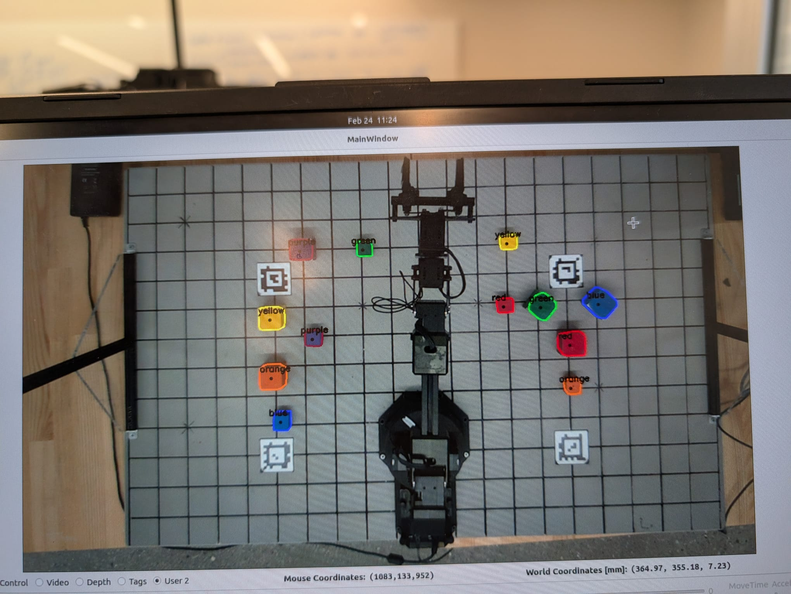

# RX200 Arm Lab — Autonomous Block Manipulation

A robotic arm system that uses computer vision and inverse kinematics to autonomously detect, pick, sort, and stack colored blocks. The arm is controlled via a state machine that coordinates a RealSense camera, AprilTag calibration, and an Interbotix RX200 5-DOF arm.

---


---

## What This Project Does

The system performs **vision-based pick-and-place** on a tabletop workspace. A RealSense L515 camera looks down at the workspace, detects colored blocks (red, orange, yellow, green, blue, purple) in RGB and depth, and converts pixel coordinates to 3D world coordinates. The RX200 arm then uses inverse kinematics to move its gripper to pick and place blocks according to different challenge modes.

### Main Capabilities

| Feature | Description |
|--------|-------------|
| **Block detection** | Detects blocks by color and size (small/large) using RGB + depth |
| **AprilTag calibration** | Uses AprilTags on the board to compute camera-to-world transform |
| **Click-to-grab** | Click a block in the GUI to pick it, click again to place |
| **Challenge 1** | Sort blocks by size — spread them (L1) or stack in rainbow order (L2) |
| **Challenge 2** | Arrange blocks in two horizontal lines (large/small) in rainbow order |
| **Challenge 3** | Stack as many blocks as possible at a single location |

### How It Works

1. **Camera** — RealSense L515 provides RGB and depth. A homography warp gives a top-down “board view” of the workspace.
2. **Calibration** — AprilTags at known positions let the system compute the camera’s pose relative to the table.
3. **Block detection** — Color segmentation and depth are used to find block centers, sizes, and orientations.
4. **Inverse kinematics** — Target (x, y, z) in world coordinates is converted to joint angles (DH or product of exponentials).
5. **State machine** — Orchestrates pick/place sequences, gripper open/close, and challenge logic.

---

## Project Media

### Block Detection

The camera detects blocks in the warped RGB view and overlays bounding boxes with color and size labels.



### Challenge 2 — Rainbow Line Arrangement

Blocks arranged in two horizontal lines (large and small) in rainbow color order (red → orange → yellow → green → blue → purple).


---

## Table of Contents

- [Code Structure](#code-structure)
- [How to Start](#how-to-start)

---

## Code Structure

### Core Components

| Path | Description |
|------|-------------|
| **`src/state_machine.py`** | State machine: idle, calibrate, click-to-grab, challenge 1/2/3, auto sort/stack |
| **`src/control_station.py`** | Main GUI; starts threads, connects buttons to state transitions |
| **`src/camera.py`** | Camera class: RGB/depth capture, calibration, homography warp, block detection |
| **`src/kinematics.py`** | Forward/inverse kinematics (DH and product of exponentials) |
| **`src/rxarm.py`** | RXArm interface: joint commands, gripper, feedback |

### Configuration

| Path | Description |
|------|-------------|
| **`config/rx200_dh.csv`** | Denavit–Hartenberg parameters for the RX200 |
| **`config/rx200_pox.csv`** | Product of exponentials (S list, M matrix) |
| **`install_scripts/config/`** | `rs_l515_launch.py` (camera), `tags_Standard41h12.yaml` (AprilTags) |

### Install Scripts

| Script | Purpose |
|--------|---------|
| `install_Dependencies.sh` | ROS2 and dependencies |
| `install_Interbotix.sh` | Interbotix arm packages |
| `install_LaunchFiles.sh` | Copies config files to correct locations |
| `install_Calibration.sh` | Camera calibration package |

---

## How to Start

### 1. Installation

Follow the [install_scripts README](install_scripts/README.md):

1. Run `./install_Dependencies.sh`
2. Run `./install_Interbotix.sh` (answer `no` to AprilTag and MATLAB prompts)
3. Run `./install_LaunchFiles.sh`
4. Run `./install_Calibration.sh`
5. Set `ROS_DOMAIN_ID` in `~/.bashrc`
6. **Reboot** before using the robot

### 2. Launch the System

From the `launch` folder:

```bash
./launch_armlab.sh          # Starts camera, AprilTag, arm
./launch_control_station.sh # Starts the control station GUI
```

See [launch/README.md](launch/README.md) for single-node launch commands.

> **Important:** Do not quit the arm unless it is in the sleep position.
