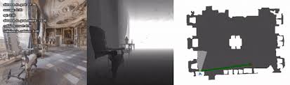

# Habitat Simulator Intro: 3D Navigation & Pathfinding

**Personal Project by Nandan NATESAN**



## What Is This Project?

This project covers loading 3D indoor scenes, rendering RGB and depth observations, understanding the world coordinate frame, pathfinding on a navigation mesh (NavMesh), and evaluating navigation performance with the **SPL** (Success weighted by Path Length) metric.

You work directly with the simulator: place an agent, compute paths, move along them, and measure how well a simple follower (GreedyGeodesicFollower) performs.

## What the Notebook Does

The `project_demo.ipynb` notebook walks through:

### 1. Setup
- Installing Habitat-Sim (Colab or local)
- Loading a 3D scene (e.g., `apartment_1`)

### 2. Rendering Observations
- Configuring RGB and depth sensors
- Placing the agent at a position and rendering what it "sees"
- Understanding the observation format (color image, depth map)

### 3. World Coordinate Frame
- How Habitat-Sim represents 3D space: **X**, **Y**, **Z**
- In the top-down map: X = columns (left–right), Z = rows (up–down), Y = height (out of the map)

### 4. Top-Down Map & NavMesh
- The **NavMesh** defines where the agent can walk (navigable regions)
- `get_topdown_view()` produces a 2D bird’s-eye map
- White = navigable, black = obstacles

### 5. Pathfinding
- Sampling random start and goal points on the NavMesh
- Using `ShortestPath` to compute the **geodesic** (shortest walkable) path
- Visualizing the path on the top-down map with `world_to_grid()` and `show_topdown_with_path()`

### 6. Observations Along the Path
- Discretizing the path into small steps (< 20 cm)
- Moving the agent step-by-step, oriented toward the next waypoint
- Collecting RGB/depth observations at each step

### 7. GreedyGeodesicFollower
- A simple controller that, at each step, chooses the action (move forward, turn left, turn right, stop) that best reduces geodesic distance to the goal
- No learning—pure geometry and heuristics

### 8. SPL (Success weighted by Path Length)
- **Success (S)**: Did the agent reach within 0.15 m of the goal? (1 or 0)
- **Optimal path length (L)**: Geodesic distance from start to goal
- **Actual path length (P)**: Sum of distances along the path the agent took
- **SPL** = S × (L / max(L, P))
- SPL rewards both success and efficiency: you get 1.0 only if you succeed and follow the optimal path exactly.

## Project Structure

```
habitat-sim-intro/
├── project_demo.ipynb    # Main demo notebook
├── images/               # Screenshots and output figures
├── README.md
├── requirements.txt
└── .gitignore
```

## Installation

### Prerequisites
- Python 3.10+
- [Miniconda](https://docs.conda.io/en/latest/miniconda.html) (recommended for Habitat-Sim)

### Setup

1. Clone the repository:
   ```bash
   git clone https://github.com/YOUR_USERNAME/habitat-sim-intro.git
   cd habitat-sim-intro
   ```

2. Create a conda environment and install Habitat-Sim:
   ```bash
   conda create -n habitat-sim python=3.10
   conda activate habitat-sim
   conda install -c conda-forge habitat-sim
   ```

3. Install other dependencies:
   ```bash
   pip install -r requirements.txt
   ```

4. For **Google Colab**, the notebook includes setup cells that install a custom Habitat-Sim build.

5. Download the test scene (e.g., `apartment_1`) as described in the [Habitat-Sim docs](https://github.com/facebookresearch/habitat-sim#installation).

## Quick Start

1. Open `project_demo.ipynb` in Jupyter or Google Colab.
2. Run the setup cells to install Habitat-Sim and load the scene.
3. Execute the notebook to render observations, compute paths, visualize them, and evaluate the GreedyGeodesicFollower with SPL.

## Key Concepts

| Concept | Description |
|--------|-------------|
| **NavMesh** | A mesh of walkable surfaces; used for collision and pathfinding |
| **Geodesic path** | Shortest path along the NavMesh (not straight-line) |
| **world_to_grid** | Converts 3D world coordinates (x, y, z) to 2D map pixels (row, col) |
| **GreedyGeodesicFollower** | Picks the action that minimizes geodesic distance to the goal |
| **SPL** | Success × (optimal_length / max(optimal_length, actual_length)) |

